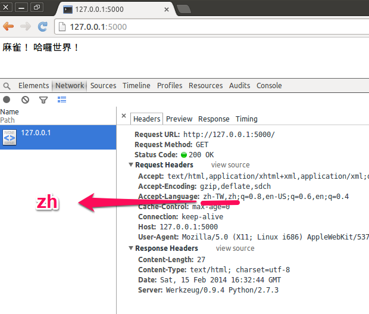

flask-babel-example
===================

This is Flask-Babel example.



##Dependency

* Flask
* Flask-Babel

##Install dependency

```
easy_install Flask

easy_install Flask-Babel
```
##Usage

Run server.
```
python app.py
```

Open a your browser, enter [http://127.0.0.1:5000/](http://127.0.0.1:5000/).

You could try to edit `translations/zh/LC_MESSAGES/messages.po`.And update `.mo` files.

```
pybabel compile -d translations
```

